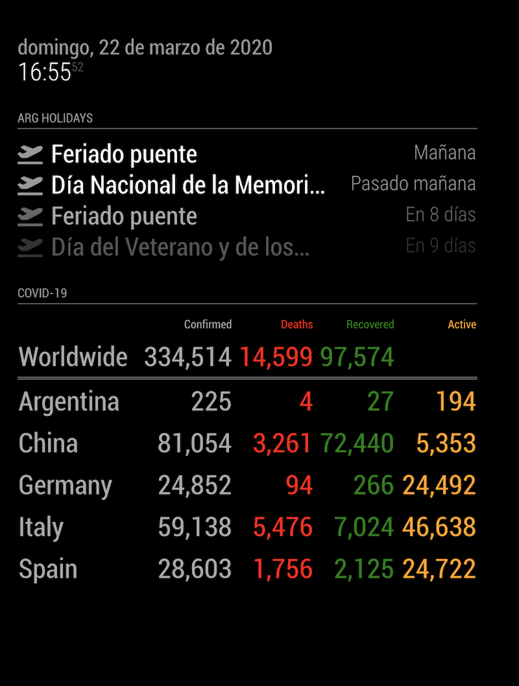
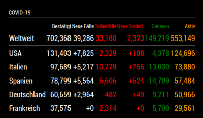

# MMM-COVID19
A [MagicMirror²](https://magicmirror.builders) helper module to track reported cases of COVID-19.

[](https://raw.githubusercontent.com/bibaldo/MMM-COVID19/master/LICENSE)

 

German translation



## Installation

In your terminal, go to your MagicMirror's Module folder:
````
cd ~/MagicMirror/modules
````

Clone this repository:
````
git clone https://github.com/bibaldo/MMM-COVID19.git
````

Add the module to the modules array in the `config/config.js` file:
````javascript
  {
    module: 'MMM-COVID19'
  },
````

## Configuration options

The following properties can be configured:


| Option                       | Description
| ---------------------------- | -----------
| `header`                     | The header text <br><br> **Default value:** `'COVID-19'`
| `worldStats`                 | Worldwide stats <br><br> **OPTIONAL** <br> **Possible values:** `false` or `true` <br> **Default value:** `false`
| `countries`                  | The countries that we want to get live COVID-19 stats <br><br> **Possible values:** `[  "Argentina, "USA" ]` <br> **Default value:** `[ "Argentina", "Italy", "Spain", "Germany" ]`
| `orderCountriesByName`       |  Order results by country name (true) or total number of confirmed cases (false)<br><br> **OPTIONAL** <br> **Possible values:** `false` or `true` <br> **Default value:** `false`
| `orderAscending`             | Sort order for `orderCountriesByName`<br><br>**OPTIONAL** <br> **Possible values:** `false` (descending) or `true` (ascending) <br> **Default value:** `false`
| `lastUpdateInfo`             | Last update info in UTC Time <br><br> **OPTIONAL** <br> **Possible values:** `false` or `true` <br> **Default value:** `false`
| `delta`                      | Show 2 more columns (New Cases and New Deaths)<br><br> **OPTIONAL** <br> **Possible values:** `false` or `true` <br> **Default value:** `false`
| `showExtraInfo`              | Show Cases per Million and Serious Cases<br><br> **OPTIONAL** <br> **Possible values:** `false` or `true` <br> **Default value:** `false`
| `highlightCountry`           | Enhances background for one country to improve visibility<br><br> **OPTIONAL** <br> **Possible values:** `"country name"` (i.e. "France") <br> **Default value:** none 
| `rapidapiKey`                | rapidApi.com api key <br><br> **MANDATORY** <br> **Check Notes**
| `headerRowClass`             | The font size of the row headers <br><br> **Possible values:** `'small'`, `'medium'`, `'big'` <br> **Default value:** `'small'`
| `infoRowClass`               | The font size of data <br><br> **Possible values:** `'small'`, `'medium'`, `'big'` <br> **Default value:** `'big'`
| `updateInterval`             | How often does the content needs to be fetched? (Milliseconds) <br><br> **Possible values:** `1000` - `86400000` <br> **Default value:** `300000` (5 minutes)

## Config Example

````javascript
  {
    module: 'MMM-COVID19',
    position: "top_left",
    config: {
      updateInterval: 300000,
      worldStats: true,
      delta: true,
      lastUpdateInfo: true,
      countries: [ "Argentina", "China", "Italy", "Spain" ],
      headerRowClass: "small",
      rapidapiKey : "01d6665ba777fdb4117cdmshc742d5373fae8f1cp148639jsn1" // this is an example, do not try to use it for real
    }
  },
````
**Notes** 
* `rapidapiKey` is **required**. You should first create an account on https://rapidapi.com/ and then go to https://rapidapi.com/astsiatsko/api/coronavirus-monitor, and use `cases_by_country` and `worldstat` endpoints

## Updating

To update the module to the latest version, use your terminal to go to your MMM-COVID19 module folder and type the following command:

````
git pull
```` 

Feel free to open any Issue :smiley:
